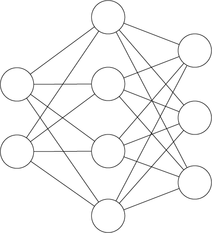
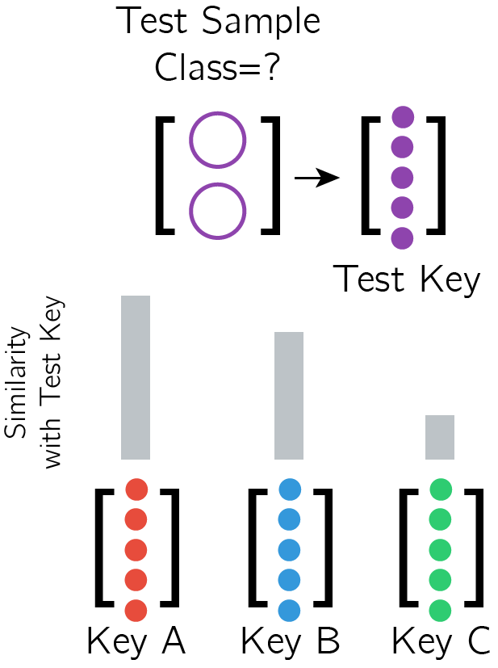
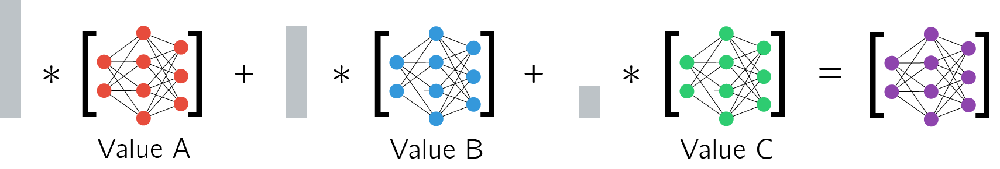
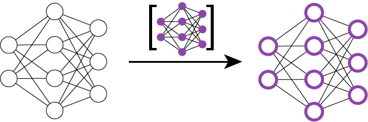

# cond-shift-neurons

Implementation of Conditionally Shifted Neurons (CSN) from:

[Munkhdalai, T., et al. **"Rapid adaptation with conditionally shifted neurons."** *Proceedings of the 35th International Conference on Machine Learning*. 2018.](https://arxiv.org/pdf/1712.09926.pdf)

The author's implementation of CSN seems to be unreleased as of yet and in any case, the author mentioned the code is in Chainer. So here's an implementation in Tensorflow!

There are some implementation differences, eg. learning rate, number of convolutional layers etc. Refer to [Implementation Differences](#implementation-differences) below for details.

*WIP - only Omniglot and using Direct Feedback (see Section 2.3 of paper) for now.*

## Instructions

First, follow the instructions [here](https://github.com/greentfrapp/cond-shift-neurons/tree/master/data/omniglot_resized/resize_images.py) to download, sort and resize the Omniglot dataset.

**Shout out and thanks to [@cbfinn](https://github.com/cbfinn/maml) for the script!**

Then just run this to train CSN on the Omniglot 5-way 1-shot task:

```
$ python main.py --train
```

Default task parameters:

- Number of classes per task `--num_classes=5`
- Number of training samples per class per task `--num_shot_train=1`
- Number of test samples per class per task `--num_shot_test=1`

Default training parameters:

- Number of metatraining iterations `--metatrain_iterations=40000`
- Batchsize per metatraining iteration `--meta_batch_size=32`
- Metalearning rate `--meta_lr=0.0003`

Run the following to view the Tensorboard log:

```
$ tensorboard --logdir=logs/
```

Finally, run this to test the trained model:

```
$ python main.py --test
```

There is the option to test with a different number of classes, by specifying `--num_test_classes`. A model trained on N-way tasks can only be tested on M-way tasks, where M <= N.

See [main.py](https://github.com/greentfrapp/cond-shift-neurons/tree/master/main.py) for the full list of flags or just run:

```
$ python main.py --help
```

## Summary

In this paper, Munkhdalai et al. built on their previous work ([Munkhdalai et al., 2017](https://arxiv.org/abs/1703.00837)) and introduced an improved adaptive-at-test-time network architecture for metalearning.

In regular neural network training, we calculate the gradients of the loss function with respect to the network parameters. These gradients are used to update the network parameters, which hopefully reduces test loss.

By aggregating parameter updates across many training iterations and samples, we ideally end up with a network that works well on any sample from the same distribution.

What if we only have an extremely small dataset? For instance, in a 5-way 1-shot task, we only have 5 training samples, 1 per class. We could train the network by simply aggregating network updates across the 5 samples. **An interesting alternative explored here is to decide which training samples are the most relevant during test time and only update the network using the most relevant training samples.** In other words, the model *shifts* and adapts to each test sample during test time.

Or to cite the paper: 
> Additionally, [conditionally shifted neurons] have the capacity to shift their activation values on the fly based on auxiliary conditioning information. These conditional shifts adapt model behavior to the task at hand.

Briefly and on a high-level, here's what happens during metatest:

*Assume a 3-way 1-shot classification task with a main classifier network. The initialization of the main classifier network has been metatrained but has not seen the new metatest task.*

<p align="center"></p>

*Main classifier network that takes in a 2-dimensional input and produces a 3-dimensional logit for classification.*

1. Each training sample is used to generate a Key-Value pair, where the Key is an embedding of the sample and the Value is the set of corresponding network updates ie. using Value of sample A (Value A) to update the classifier is similar to training the classifier on sample A <p align="center"></p> *Each 2-dimensional sample generates a Key (5-dimensional in this case) and Value (neuron-specific network updates).*

2. Each test sample is also used to generate a Key, which is then compared against the Training Keys, with an attention/alignment mechanism <p align="center"></p> *Each test sample also generates a Key, which is compared against the Training Keys.*

3. Calculate a set of network updates using the alignment of the Test Key with the Training Keys eg. if the post-softmax alignment is (0.5, 0.4, 0.1) then take 50% of Value A + 40% of Value B + 10% of Value C <p align="center"></p> *The update for the test sample is a weighted sum of the training samples' Values.*

4. *Shift* the main classifier network using the calculated set of network updates (termed as Conditionally Shifted Neurons) <p align="center"></p> *Use the calculated network updates to shift the network - basically adding the updates to the neurons (see Equation 1 in paper).*

5. Classify the test sample with the shifted network <p align="center"></p>

Put simply, if the test sample is most aligned to training sample A, we use gradient information derived from training sample A to *shift* the network and classify the test sample.

**But if the test sample is most aligned to training sample A, why don't we just classify it to be the same class as training sample A?**

We can do that, but consider the case where the test sample is equally aligned to all three samples. Then the algorithm automatically incorporates gradient information from all three samples to make the classification. If we just use the alignment to make the decision, we would be stuck.

## Interesting Notes and Relations

*These are my observations and not mentioned by the authors ie. any mistakes are entirely on my part.*

**1-step Gradient Descent**

In the case that gradient information from 1 training sample is used, the shifted network is akin to the initial network plus one step of gradient descent on the single training sample.

Likewise, if gradient information from all training samples are used, the shifted network is akin to the initial network plus one step of gradient descent on the entire training set as a single minibatch.

CSN can hence be seen as a general form of these two cases.

**Relation to Learned Initializations**

During metatraining, the main network is also trained such that the initial network plus a one-step *"shift"* during test time should be sufficient to classify the test sample correctly.

Hence, the metatraining of CSN also optimizes the parameters/*"initialization"* of the initial network, similar to MAML by Finn et al. ([2017](https://arxiv.org/abs/1703.03400)) and Reptile by Nichol et al. ([2018](https://arxiv.org/abs/1803.02999)). 

Considered as a more general form of MAML, CSN parameterizes the network update function, whereas MAML/Reptile uses a regular gradient descent algorithm. (But using a parameterized update for MAML/Reptile is definitely possible.)

**Relation to Learned Optimizers**

Andrychowicz et al. ([2016](https://arxiv.org/abs/1606.04474)) and Ravi & Larochelle ([2017](https://openreview.net/pdf?id=rJY0-Kcll)) introduced parameterized optimizers, which allowed us to optimized optimizers (hohoho!). 

Similarly, the Value Function here is a sort of parameterized optimizer that takes in gradient information and outputs network updates ie. the *"shifts"*. The algorithm also incorporates training and test information to output the final set of CSNs for classification. This is akin to a dynamic optimizer that uses gradient information and sample context to output an optimized update.

**Relation to Metric-based Metalearners**

As mentioned earlier, it could be possible to use the calculated alignment between test and training samples to directly output the classification.

This would then be similar to Matching Networks by Vinyals et al. ([2016](https://arxiv.org/abs/1606.04080)) and Prototypical Networks by Snell et al. ([2017](https://arxiv.org/abs/1703.05175)), as well as the use of Siamese networks in Koch's thesis ([2015](http://www.cs.utoronto.ca/~gkoch/files/msc-thesis.pdf)).

However, instead of classifying based on a similarity metric, the similarity/alignment here is used to provide information for updating a classification network. This might be arguably more robust than metric/similarity-based metalearners, although less efficient.

## Implementation Differences

### adaCNN for Omniglot 5-way 1-shot

In general, no dropout is implemented here, in contrast to the paper. The Adam optimizer also has a smaller learning rate of 3e-4, rather than 1e-3 reported in the paper (Appendix A). No gradient clipping is used.

**Main Network**

- I use 4 convolutional blocks where each block comprises of:
	- CNN layer with 3x3 kernel, with padding, with 32 filters and ReLU activation
	- Max pool layer with pool size of 2x2 and stride of 1x1
- The output is flattened and fed to a dense layer to give the logits

The paper is somewhat confusing here, where Section 4.1 mentions using 64 filters and 5 layers while Appendix A Table 4 reports 32 filters and 5 layers. 

**Key Function**

- Similar to the Main Network but with 2 convolutional blocks instead
- The output is flattened and fed to a dense layer with 32 units

The paper mentions using another network with the same architecture as the main network for the key function.

**Value Function**

- The input is a flattened form of the Direct Feedback gradients
- I use a network with three dense layers:
	- 32 hidden units and ReLU activation
	- 32 hidden units and ReLU activation
	- 1 hidden unit and no activation

The paper mentioned using a 3-layer MLP with ReLU activation with 20 or 40 units per layer.

**Others**

- For the Conditionally Shifted Neurons, I perform the *shift*/addition before the ReLU activation function instead of after (see Equation 1 in paper)
- The soft-attention mechanism is the same as described in the paper
- The Direct Feedback conditioning is the same as described in the paper

